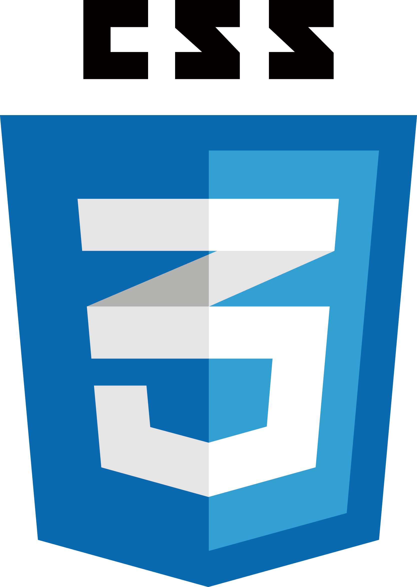

# Webのフロントエンドに触れてみよう

皆さんはWebページを必ず見た事があると思います。  
Webのフロントエンドとは、ユーザーが普段ブラウザを使って閲覧しているWebサイトの目に見える部分のことを指します。  

HTML、CSS、JavaScriptを使いウェブサイトの  
・内容（テキストや画像など）  
・見た目（文字の大きさや背景の色など）  
・動き（ボタンを押したら画像が切り替わったりスクロールしたり）  
などを作っていきます。  


上記のようにフロントエンドを作成するときに主に３つの言語を使用します。
HTML
CSS
JavaScript

## HTML5  


HTML5（HyperText Markup Language）はマークアップ言語という  
ウェブコンテンツに構造と意味を与えるための言語です。  
例えば文章に段落をつけたり、見出しや表を定義できます。  
また画像や動画も入れることができます。  
書き方は、タグというもので要素を囲んで記述します。  

```html
<h1>見本</h1>
<h2>見本</h2>
<p>見本</p>


```

## CSS3  




CSS3（Cascading Style Sheets）は、HTMLコンテンツに適用するスタイルシートの言語です。  
例えばページの背景色を設定できます。そのほかにも画像のサイズ、縦並びや横並びなどの指定、  
そして最近ではアニメーションなども簡単に実装できます。  

```css
h1 {
    color:#ffffff;
    font-size: 30px;
}    

p {
    sont-size: 15px;
    padding: 10px;
}

```


##  JavaScript 


JavaScriptはウェブページにて複雑なことをできるようにするプログラミング言語です。  
さまざまなもの（Webサイトやスマートテレビ、最新の車など）に使われているのですが、  
WebのフロントエンドにおけるJavaScriptの役割は、  
動的にコンテンツを更新したり主に動きの部分の役割が大きいです。    

```js
var hoge = document.querySelector('p');

hoge.addEventListener('click', updateName);

function updateName() {
    var name = prompt('名前を入力してください');
    hoge.textContent = name;
}
```

今回はこの3つの使い方について説明していきます。

