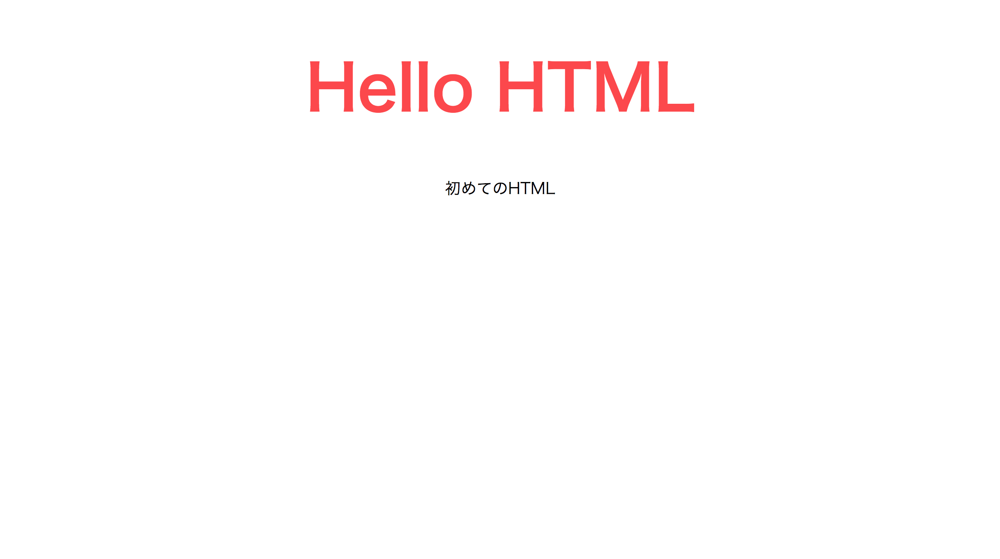
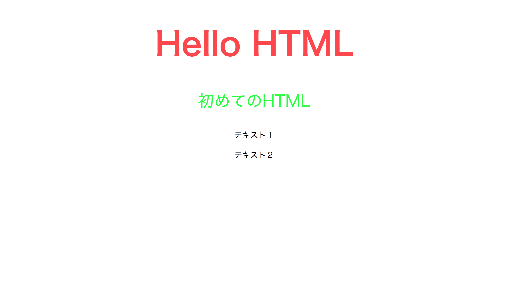

# CSSを書いてみよう


## CSSとは


ウェブページのスタイルを指定するための言語です。 ワープロソフト  
などで作成される文書も含めて、文書のスタイルを指定する技術全般  
をスタイルシートといいます。 HTMLやXHTMLなどで作成されるウェ  
ページにスタイルを適用する場合には、スタイルシート言語の1つで  
あるCSSが一般的に利用されています。

CSSは、HTMLと組み合わせて使用する言語です。 HTMLがウェブペー  
ジ内の各要素の意味や情報構造を定義するのに対して、CSSではそれら  
をどのように装飾するかを指定します。 例えば、ウェブページが画面  
に表示される際の色・サイズ・レイアウトなどの表示スタイルや、 プ  
リンタなどの機器で印刷・出力される際の出力スタイル、 音声で読み  
上げられる際の再生スタイルなど、 ウェブページをどのようなスタイ  
ルで表示・出力・再生するかについて指定することができます。     

## CSSの書き方 


CSSには文字の大きさを変えたり、カラーを変更したり、幅を均等にし  
たりといったスタイルを記述します。  

CSSの記述はどこの（セレクタ）なにを（プロパティ）どうするのか  
（値）をこのように記述します。  

```css
セレクタ { プロパティ: 値; }
```

## サンプル  

では実際に書いてみましょう。

まずエディタ上で新規ファイルを作成し、すぐに保存します。保存場  
所は先ほど作成したindex.htmlファイルと同じ場所にします。ファイル  
名は「style.css」としましょう。    


```css
h1 {
    font-size: 80px;
    text-align: center;
    color: #ff4646;
}
p {
    font-size: 40px;
    text-align: center;
}
```

こちらの記述終わったら保存しましょう。現状では、こちらの  
style.cssはindex.htmlに反映されていません。  

index.htmlにstyle.cssを適用するには、index.htmlにstyle.cssを読み込  
む必要があります。  

実際にやってみましょう。まずindex.htmlファイルをエディタで開きま  
す。そしてhead内に７行目のコードを追加しましょう。  


```html
<!DOCTYPE html>
<html lang="ja">

<head>
    <meta charset="utf-8">
    <title>HTMLサンプル</title>
    <link rel="stylesheet" href="style.css">
</head>

<body>
    <h1>Hello HTML</h1>
    <p>初めてのHTML</p>
</body>

</html>
```

linkタグで外部のファイルを読み込むことができます。hrefでstyle.css
を選択します。

ここまで記述できたらこちらを保存してブラウザで開きましょう。す
でに開いてある場合は、ブラウザ上で更新（command(Ctrl) + r）をす
ると反映されます。

ブラウザが下記のようになっていれば成功です。 



##  idとclassについて

index.htmlファイルに13〜14行目を追記します。

```html
<!DOCTYPE html>
<html lang="ja">

<head>
    <meta charset="utf-8">
    <title>HTMLサンプル</title>
    <link rel="stylesheet" href="style.css">
</head>

<body>
    <h1>Hello HTML</h1>
    <p>初めてのHTML</p>
    <p>テキスト１</p>
    <p>テキスト２</p>
</body>

</html>
```
こちらを保存してブラウザを更新すると「テキスト１」と「テキスト  
２」が表示されます。では、「初めてのHTML」のみ文字の色を緑にし  
たい場合はどのようにすれば良いでしょうか。  

現在のCSSでは、pタグを一括で囲っているので下記の９行目のように  
pタグにcolorを設定するとすべてのpタグの文字が緑になってしまいま  
す。   

##  head要素

```css
h1 {
    font-size: 80px;
    text-align: center;
    color: #ff4646;
}
p {
    font-size: 40px;
    text-align: center;
    color: #00ff2a;
}
```

このような場合にidやclassを使います。まず、index.htmlファイルの初  
めてのHTMLのpタグ内にidを設定します。   


##  body要素

```html
<p id="content">初めてのHTML</p>
```

そして、style.cssファイルでカラーを変更します。idを指定する場合は  
id名の前に「#」を記述します。     

```css
h1 {
    font-size: 80px;
    text-align: center;
    color: #ff4646;
}
p {
    font-size: 40px;
    text-align: center;
}
#content {
    color: #00ff2a;
}
```


これで「初めてのHTML」の文字のみ緑色になりました。このようにど  
れか１つの要素のスタイルのみ変更したい場合は「id」を使用します。  
次にclassですが、こちらは複数の要素のスタイルを変更したいときに  
使用します。では、テキスト１とテキスト２の文字のサイズを変更し  
ましょう。実際に13〜14行目に「class="text"」を追記していきます。   

```html
<!DOCTYPE html>
<html lang="ja">

<head>
    <meta charset="utf-8">
    <title>HTMLサンプル</title>
    <link rel="stylesheet" href="style.css">
</head>

<body>
    <h1>Hello HTML</h1>
    <p　id="content">初めてのHTML</p>
    <p class="text">テキスト１</p>
    <p class="text">テキスト２</p>
</body>

</html>
```

そしてCSSでフォントサイズを変更します。classを指定する場合は  
class名の前に「.」を記述します。  


```css
h1 {
    font-size: 80px;
    text-align: center;
    color: #ff4646;
}
p {
    font-size: 40px;
    text-align: center;
}
#content {
    color: #00ff2a;
}
.text {
    font-size: 20px;
}
```

index.htmlとstyle.cssファイルを保存し、ブラウザを更新します。  

これでテキスト１とテキスト２の文字のサイズが変更されたかと思い  
ます。  



idとclassの使い分けについては少し複雑なのですが、初め  
はidが1つの要素のみ変更するとき、classが複数の要素を変  
更するときと覚えておけば大丈夫です。気になる人は調べて  
みましょう。  