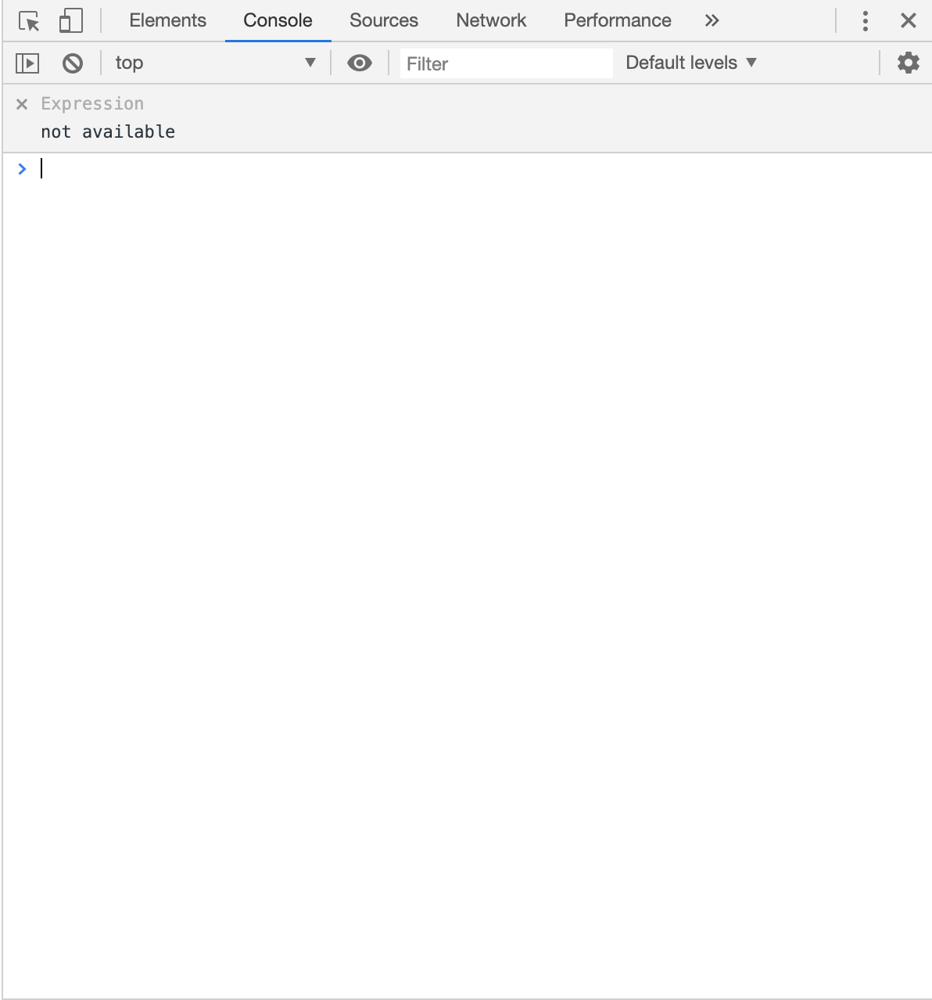

# JavaScriptを書いてみよう


## JavaScriptの記述


JavaScriptとは、ウェブアプリ開発などで使用されるプログラミング言  
語です。  

ちなみに語呂が似ている「Java」とは全く別の言語になっているので  
注意してください。JavaScriptを略す場合は「JS」になります。  

JavaScriptで作ることができる代表的なものに下記のようなものがあり  
ます。 

・Webページの動作  
・Webアプリ開発  
・スマホアプリ開発  
・ゲーム開発  

## サンプル 


では実際に書いてみましょう。  

まずはエディタ上で新規ファイルを作成し、すぐに保存します。保存  
場所はindex.htmlやstyle.cssファイルと同じ場所にしてください。ファ  
イル名は「main.js」とします。  

次にmain.jsファイルをindex.htmlファイルに読み込むためにindex.html  
ファイルに16行目のコードを追加します。   

```html
<!DOCTYPE html>
<html lang="ja">

<head>
    <meta charset="utf-8">
    <title>HTMLサンプル</title>
    <link rel="stylesheet" href="style.css">
</head>

<body>
    <h1>Hello HTML</h1>
    <p　id="content">初めてのHTML</p>
    <p class="text">テキスト１</p>
    <p class="text">テキスト２</p>
    
    <script src="main.js"></script>
</body>

</html>
```

これでmain.jsファイルを読み込むことができました。  

では、main.jsファイルにJavaScriptコードを記述します。 

```javascript
alert("Hello JS!");
```
ここまで書き終わったらindex.htmlとmain.jsファイルを保存してブラウ  
ザを更新してください。  

このようなアラートが出てくれば成功です。  


次にJavaScriptからブラウザの文字を変更します。

```javascript
alert("Hello JS!");

var subTitle = document.getElementById('content');
subTitle.textContent = '初めてのJS';
```

書き終わったら保存してブラウザを更新してください。「初めての  
HTML」という文字が「初めてのJS」と変わっていたら成功です。 

z


## console.log について 

次にconsole.logについて説明をして行きます。  
console.logは、値をデバッガーのコンソールに表示する関数です。  
GoogleChromeで右クリックを使用しコンテキストメニューを表示して  
ください     


その中にある検証をクリックしてみましょう。


右側にこのようなものが表示されます。これをデベロッパーツールと  
言います。  
これを使いエラーが出ているかを判断して行きます。  
では実際にエラーを確認してみましょう。  
Consoleタブを開いてみましょう。  


この状態はエラーが出ていない状態です。  
では実際にエラーを表示してみましょう。  
わざとエラーを出すために先ほど書いたalert("Hello JS!");の前にこんに  
ちはと書いてみましょう。  
実際に書くとこうなります。  
```js
こんにちはalert("Hello JS!");
```

では確認してみましょう。  


このように表示されたらエラーが出ています。  
この場合はmain.jsの1行目にエラーがありますと表示されています。  
このエラーを直すと表示されなくなります。  
先ほど書いた"こんにちは"は取り除きましょう。  

ではここでconsole.logを使用してみましょう。  
6行目に追加してください。  
```js
alert("Hello JS!");

var subTitle = document.getElementById('content');
subTitle.textContent = '初めてのJS';

console.log('Hello Js');
```

ではcosoleを確認してみましょう。


console.logを使用することで便利なことがたくさんありますが、ここ
では使用方法だけの紹介にしておきたいと思います。
ここからはconsole.logを使いながらプログラミングでよく使われる処
理をJavaScriptで学んでいきます。


##  変数宣言

次に変数についての説明をしていきます。  
変数とは、名前をつけた箱に数値などのデータを格納することで、必  
要に応じて簡単に利用できるようにしたものです。  
今回はよく使われている変数宣言をする方法として'let','const',を説明し  
ます。  

まずはletについて説明していきます。  
letは再代入が可能な変数宣言の方法です。  
またletでは同じ変数名を定義するとエラーがおきます。こちらをみて  
みましょう。  

```js
let x;
let x;
```
この場合は同じ変数名を宣言しているのでエラーが出ます。  

次ににconstの説明です。  
constは再宣言と再代入が不可能な変数宣言になります。  

```js
const x = 1;
const x = 2;
```

この場合は再宣言かつ再代入をしようとしているのでエラーが出ま  
す。  

では代入を確認して行きます。  
以下のコードを書いてください。

```js
const x = 1;
console.log(x);
```

では確認して行きましょう。  


代入がされているとconsoleに１と表示されます。

##  条件分岐

次に条件分岐についてです。  

条件分岐とは、条件文によって、処理が分岐するかどうかを決定する  
命令のことです。  
条件分岐を行う場合は'if'を使います。  
では使用してみましょう。  

```js
const x = 1;
console.log(x);

if (x == 1){
    console.log('こんにちは');
}
```

const x = 1と代入をします。  
ifではx == 1とすることでxが１の場合にconsole.logに“こんにちはと出  
力してください“という指示をしています。  
それ以外の数の場合は条件に合わないので何も表示されません。  
ではconsoleを確認して行きましょう。     


このように、”こんにちは”と表示されていれば成功です。  
ではconstの中身を２にして、条件から外してみましょう。 


表示されなくなったら成功です。  

if文にはelse ifという拡張構文が存在しています。  
まずは使い方を見てみましょう。  

```js
const x = 2;
console.log(x);

if (x == 1){
    console.log('こんにちは');
} else if (x == 2){
    console.log('おはようございます'); 
}
```
この文では「xが１の時は“こんにちは“、xが２の時は“おはようござい  
ます“とコンソールに表示してください」という指示を出しています。  
では結果をみてみましょう。  


2の場合は“おはようございます“になりました。
ではconstのxを1に戻してみましょう。


1の場合は“こんにちは“になることが確認できました。  

次にelseについて説明して行きます。  
elseもif文の拡張構文になります。  
まず使い方をみていきましょう。  

```js
const x = 10;
console.log(x);

if (x == 1){
    console.log('こんにちは');
} else if (x == 2){
    console.log('おはようございます'); 
} else {
    console.log('こんばんは');
}
```

if,else if,以外の条件の場合はconsole.logでこんばんはと出力してください。
ではみてみましょう。


elseの場合はそれ以外の条件になるので条件式を書く必要はありませ  
ん。  
なのでこの場合は1でも2でもない場合は全て“こんばんは“になります。  
状況に応じて使用して行きましょう。  


チャレンジ！  
if,else if,elseを使用してコンソールに60を出力してみましょう。  

条件1:変数宣言はxとyを使用してください。  
条件2:条件分岐を使ってelseの結果がコンソールに表示されるようにしてください。  
条件3:elseで出力するのはconsole.log(x+y);にしてください。  

##  forループ

プログラムを書いていく中で繰り返し出力してほしい状況がありま  
す。  
まずはこれをみてみましょう。  

```js
<p id="content">初めてのHTML</p>
```

そして、style.cssファイルでカラーを変更します。idを指定する場合は  
id名の前に「#」を記述します。     

```css
console.log(1);
console.log(2);
console.log(3);
console.log(4);
console.log(5);
console.log(6);
console.log(7);
console.log(8);
console.log(9);
console.log(10);
       .
       .
       .
console.log(20);
```
このように1から20まで出力をしたいときに20個のconsole.logを表記  
するのはとても面倒で、見づらい文になってしまいます。  
このような場合はforループを使用します。  
まずはこちらをみてみましょう。  

```js
for ( let num = 1 ; num <= 20 ; num++ ){
    console.log(num);
  }
```
ここでは「1に1ずつ足していき、それを20以上になるまで繰り返して  
ください。」と指示しています。  
まずは変数宣言が必要です。  
今回はletを使用して行きます。  
これまで使用していたconstでは値を変えることができないのでエラー  
が出てしまいます。  
letは値を再代入できるので値が変わった時も出力することができま  
す。  

次に宣言した変数を再代入する最大の値を書きます。  
この場合は20まで出力して欲しいので<=を使用して20まで出力して欲  
しいということを指示しています。  
これを<にすると19まで出力してくださいという指示になります。  
用途に応じて使い分けて行きましょう。  
最後にnum++についてです。  
ここでは1ずつ増やしてくださいという指示をしています。  
では結果をみてみましょう。  


このように表示されいれば実行されています。  
for文では--を使用することで１ずつ減らすこともできるのでこちらも用  
途に合わせて使い分けてください。 

チャレンジ！
for文を使用してコンソールに20から１ずつ減らして、1までを  
出力しましょう。  


##  関数

関数は JavaScript の基本的な構成要素のひとつです。また関数は、  
JavaScript の手続き ― つまり、タスクや値計算を実行する文の集まり  
です。  
まずはこちらをみてみましょう。  

```js
function num(){
 const x = 20;
 const y = 20;
 
 console.log(x+y);
}
```

これはnumという箱に格納したという状態になります。  
変数を宣言をし各変数に20という値をそれぞれに格納した状態です。  
そしてconsole.logで二つを足した数字をコンソールに出力するという  
指示になります。  
ではコンソールを確認しましょう。 



これだけではコンソールには反映されません。
もう一度コードを見てみましょう。

```js
function num(){
 const x = 20;
 const y = 20;
 
 console.log(x+y);
}
num();
```

これは指定した関数名を呼び出している形になります。  
ではコンソールを確認してみましょう。  


コンソール上に足された数字が出ています。  
こうなっていれば実行されていることになります。  

関数は様々な形で作成して、使用することができます。  
用途に合わせて自由に使っていきましょう。  

これでweb初級は終了となります。  
次の教科書へ進んでください。  